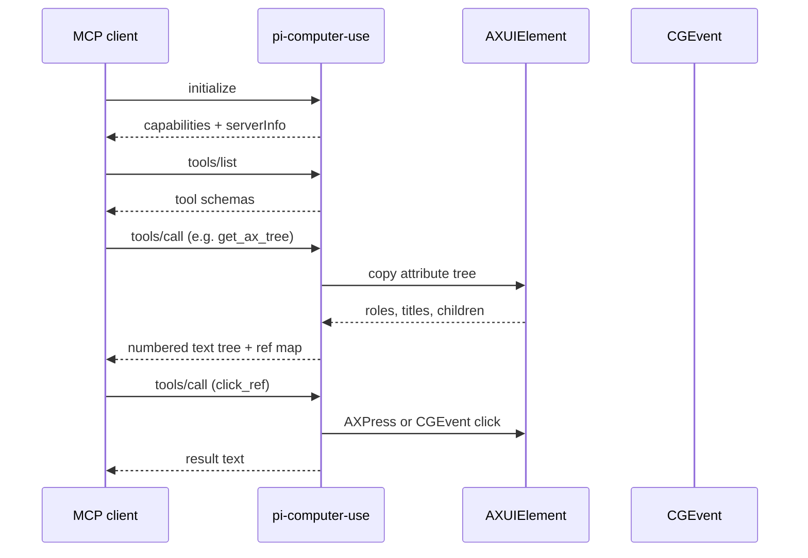

# Architecture

pi-computer-use is a single Swift executable that can run in two modes:

| Mode | Invocation | stdout |
|---|---|---|
| **MCP server** | no args, or `pi-computer-use serve` | JSON-RPC lines only |
| **CLI** | `pi-computer-use <subcommand> …` | human text or `--json` |

Logging always goes to **stderr** (`[pi-computer-use] …`) so MCP framing on stdout stays intact.

## Module split

```
Package.swift
├── PiComputerUseCore          (library, no AppKit / AX — CI-testable)
│   ├── Version.swift
│   ├── CLIArgs.swift
│   └── JSONRPC.swift
├── PiComputerUseMac           (library — all macOS-specific code)
│   ├── Accessibility.swift    AX tree walk, find, refs, permissions
│   ├── Input.swift            CGEvent click/type/key/scroll
│   ├── Screenshot.swift       screencapture + window id
│   ├── AppRegistry.swift      list/activate apps
│   └── Tools.swift            tool implementations + registry
└── pi-computer-use            (executable)
    └── main.swift             MCP loop + CLI dispatch
```

Permission-sensitive code lives only in `Sources/PiComputerUseMac`. Pure helpers
belong in `PiComputerUseCore` with matching tests under `Tests/PiComputerUseCoreTests/`.

## Control flow (MCP)



## Element references (`@eN`)

`get_ax_tree` and `ax_tree_json` populate an in-process `refMap: [Int: AXUIElement]`.
Refs are **invalidated** on the next tree dump for the same process. Agents should
either:

- re-fetch the tree before `click_ref`, or
- use `click_element` / `find_element` with a stable substring query.

## Input synthesis

| Action | Primary path | Fallback |
|---|---|---|
| Click | `AXPress` on element | `CGEvent` left click at element center |
| Right click | — | `CGEvent` right button at center |
| Type | `CGEvent` Unicode keystrokes | — |
| Key combo | `CGEvent` virtual key + flags | — |
| Scroll | `CGEvent` scroll wheel | optional focus point from element center |

## Screenshots

`screenshot` shells out to `/usr/sbin/screencapture`. When `bundle_id` is set,
the tool resolves the app's main window via `CGWindowListCopyWindowInfo` and
captures that window. This requires **Screen Recording** permission in addition
to Accessibility for some macOS versions.

## Browser-level Chrome backend

The optional `pi-chrome` MCP server and Pi extension handle browser pages
separately from the Swift desktop backend. A shared Node daemon owns the single
browser-extension WebSocket; MCP/Pi clients connect to its authenticated
loopback control socket. This lets multiple Pi sessions share one Chrome
profile without competing for the browser port.

The extension uses `chrome.tabs`, `chrome.scripting`, and `chrome.debugger` to:

- list and create tabs in the user's existing Chrome profile;
- require explicit claims before mutating existing tabs;
- capture visible DOM snapshots with versioned node ids;
- perform DOM clicks and form fills without moving the macOS pointer;
- send browser-scoped keyboard events and capture background screenshots; and
- wait for page text or selectors after asynchronous navigation.

This gives Pi a browser-level surface similar to Codex's Chrome connector while
keeping the implementation independent of Codex's proprietary turn metadata.
The browser bridge is installed with `scripts/install-chrome.sh`; see
[`docs/chrome-browser.md`](chrome-browser.md).

A Pi package adapter is also available in `extensions/pi-chrome.js`. In Pi
extension mode it registers direct `pi_chrome_*` tools and owns the bridge for
the session lifecycle. The standalone `pi-chrome` MCP server remains available for other MCP clients;
all clients should use the shared daemon rather than binding the browser port
independently.

The native backend remains important. It handles Finder, Slack desktop, native
settings, canvas-like regions, and browser UI that is not exposed through the
DOM. It uses the Accessibility tree first and CGEvent only as a documented
foreground fallback.

## Why not CDP / Playwright in the native backend?

CDP attaches to a browser process and sees the DOM. The Swift
`pi-computer-use` backend intentionally remains a macOS desktop backend rather
than embedding a browser runtime. The separate `pi-chrome` bridge owns the DOM
workflow so a normal, logged-in Chrome profile can be controlled without sending
CGEvents to the whole desktop.

Trade-offs:

- the browser extension has broad page permissions and must be loaded only in a
  profile the user trusts Pi to access;
- the shared daemon uses one browser/control port pair per Chrome profile;
  multiple Pi sessions share it;
- DOM actions do not replace native Accessibility for opaque canvas content;
- the native backend remains macOS-only; no Linux/Windows support is planned.

## CI vs local dev

GitHub Actions runs `swift build` and `swift test` on `macos-14` and `macos-15`.
Tests cover `PiComputerUseCore` only. Integration tests that require Accessibility are not
run in CI; use `./scripts/smoke-test.sh` locally after granting permissions.
